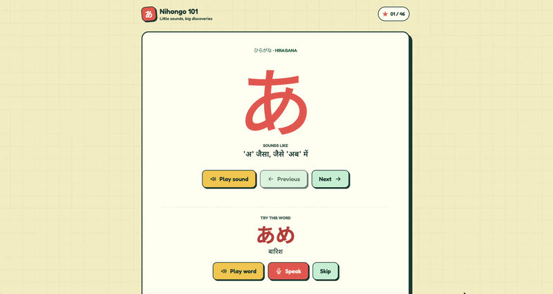

# Nihongo 101 🇯🇵

This project is built for Hacktoberfest Weekend Challenge: **Build for a Friend**.


Nihongo 101 is a small Japanese tutor I built for my little brother, who is in 6th grade and wants to learn Japanese. His first language is Hindi, so the tutor teaches through Hindi instead of English: every new sound comes with a Hindi hint, and the Hindi shrinks as he progresses.

## Demo

Click the GIF to watch full demo.

[](https://drive.google.com/file/d/1CXY9eTg1EDWtAQWfLSwHTHcGMyRqBjTB/view?usp=drive_link)

## Why I made this

My brother is excited about learning Japanese, but almost every beginner resource assumes you are fluent in English, or if it's in your first language, the lessons are paid. Duolingo doesn't help here because it does not provide offline support, and internet means distractions for a now-6th grader.
SO I thought, he shouldn't have to learn through a second language(English) just to learn a third one(Japanese). So I made something that speaks his language, runs on his own laptop, and is patient with him.

## What it does

- Teaches the 46 basic hiragana, one at a time, with a Hindi hint for each (like "'क' जैसा, जैसे 'कल' में")
- Plays a native-sounding audio clip for every sound and example word
- Gives each character an example word (あ → あめ, "rain") so he learns from real words
- **Say it and I'll check:** The app has mic feature for practicing words, he taps the mic, says the word, and the app tells him whether it heard it right. Feedback is always gentle, and he can skip any word.
- Mistake explainer: when he gets a word wrong, a local language model explains in simple Hindi what to listen for.
- He can also use Ask the tutor feature to ask his curious questions that come up while going through the lessons.


Katakana is in the plan, but I held it back on purpose. His 6th grade syllabus from the book Ume mentions complete Hiragana as learning outcome by end of the year.

## How it works

| Piece                                       | What I used                                                                            | Runs where                                                        |
| ------------------------------------------- | -------------------------------------------------------------------------------------- | ----------------------------------------------------------------- |
| Listening (checks his speaking)             | [faster-whisper](https://github.com/SYSTRAN/faster-whisper), open-weight Whisper model | Locally, on the laptop                                            |
| Explaining mistakes and answering questions | Gemma via [Ollama](https://ollama.com), through an OpenAI-compatible API               | Locally, swappable for any OpenAI-compatible model                |
| Server                                      | FastAPI                                                                                | Locally                                                           |
| Lesson audio                                | ElevenLabs                                                                             | Once, at build time. The mp3 files are saved and played from disk |
| App                                         | Plain HTML and JavaScript                                                              | Browser                                                           |

The lessons are fixed and verifiedin `lesson.json`. Katakana lessons are on-hold for now. The AI handles the parts that need listening and explaining, and the curriculum stays under my control.

## Guardrails for a kid-facing model

A small model is confident even when it's wrong, so I don't rely on the prompt alone:

- A code gate before the model. If a question doesn't look related to learning Japanese, the model is never called. The question is saved to questions.txt and he's told I'll answer it.
- A tight system prompt that limits answers to Japanese, short replies in simple Hindi, hiragana only, and "say you're not sure instead of guessing."
- Low temperature and a short reply limit to keep answers steady.
- Fallback messages. If the model is slow or fails, the app still works with a pre-written gentle message.
- A reminder under every model answer that it might be wrong.

Again, since we're using a small model, it is prone to mistakes and needs to be fine-tuned further.

## Setup

You need Python 3 and a Mac or Linux machine (I built this on a MacBook M4).

```bash
git clone <repo-url>
cd nihongo-tutor

python3 -m venv .venv
source .venv/bin/activate
pip install -r requirements.txt
```

Install [Ollama](https://ollama.com) and pull a model (I used Gemma, a small version that fits in 16GB of RAM):

```bash
ollama pull gemma3:4b

ollama run gemma3:4b
```

Then start the server:

```bash
uvicorn server:app --port 8000>
```

Open `http://localhost:8000` in your browser and allow the microphone when asked. **Use this address, not an editor's live preview.** The page needs the FastAPI server for the mic check and the tutor features.

**Note:** the first time you run it, faster-whisper downloads its model, so you need internet once. After that, everything works offline.

### Choosing the model

The model is set in `.env`, so you can swap it without touching code:

```
LLM_BASE_URL=http://localhost:11434/v1
LLM_MODEL=gemma3:4b
LLM_API_KEY=ollama
```

Any OpenAI-compatible endpoint works, local or hosted. Run `python3 test_llm.py` to check that the connection works.

### Regenerating the audio (optional)

The audio is generated with ElevenLabs. If you want to regenerate it or change the voice, add these to `.env`:

```
ELEVENLABS_API_KEY=your_key_here
ELEVENLABS_VOICE_ID=your_voice_id_here
```

Then run `python3 generate_audio.py` (or `python3 generate_audio.py hira_a` for a single lesson). Never commit your `.env` file.

## Project structure

```
nihongo-tutor/
  server.py           FastAPI server: /check, /explain, /ask
  llm.py              Swappable LLM client (reads .env)
  test_llm.py         Quick check that the model responds
  index.html          The app
  lesson.json         All lessons: characters, hints, example words
  generate_audio.py   Makes the mp3 files (run once)
  check_words.py      Checks that every lesson has an example word
  audio/              Generated audio
  questions.txt       Saved off-topic questions (created at runtime, not committed)
```

## Why open-source AI?

- **His voice stays on his laptop.** The mic recording is transcribed locally and thrown away. Nothing about a child's voice or mistakes goes to someone else's server.
- **It works without internet** once the models are downloaded.
- **It costs nothing to run.** No per-request fees and no API key needed for daily use.
- **I can change it.** I can swap the speech model or the language model, tune the matching to how a kid actually speaks, and compare models on real Hindi questions. With a closed API, I'd have to take what it gives me.

I'll be honest about the one closed piece: I used ElevenLabs for the lesson audio, because good Hindi and Japanese voices matter for pronunciation and I only needed them once. Everything that touches him day to day is open and local.

## What I learned

- **Small models need guardrails in code, not just in prompts.** I tested the tutor box with a question about a pop group, and the 4B model answered confidently with made-up details, even though its prompt said to stick to Japanese. That's why a gate runs before the model, and why off-topic questions are saved for me instead of answered by the model.
- A kid's curiosity shouldn't be blocked. Removing the text box would have been safer but wrong for him, so questions the tutor can't answer get saved for me to answer personally.
- The model needs to be fine-tuned further, for it still gets confused when asked about time or numbers.
-

## What my brother said

My brother found it really fun and helpful especially the mic feature, he said, "So cool!"

## What's next

- Fine-tuning further so the model knows when to respond in Hindi or English.
- Testing the application further against tougher questions as the level increases.
- A "time and numbers" helper that uses code, not the model, so readings are always correct
- Katakana as a second level
- A progress tracker for the lessons completed, and a review button.

## Credits

Built by @jaeytea . Thanks to my brother for being my first (and toughest) user.
